# Laravel Sail + Octane + FrankenPHP Configuration Diagram

```mermaid
flowchart TB
    User[👤 User Browser] -->|HTTP Request| Host[🖥️ Host Machine<br/>localhost:4410]

    Host -->|Port Mapping<br/>4410:80| Docker[🐳 Docker Container<br/>franken-laravel-app-1]

    subgraph Container ["🐳 Docker Container (sail-8.4/app)"]
        direction TB

        Supervisor[📋 Supervisord<br/>Process Manager] -->|Starts & Monitors| PHP[🐘 PHP Process]

        PHP -->|Executes| Artisan[⚡ Artisan Command<br/>octane:start --server=frankenphp<br/>--host=0.0.0.0 --port=80]

        Artisan -->|Initializes| Octane[🚀 Laravel Octane<br/>Application Server]

        Octane -->|Uses| FrankenPHP[🏃‍♂️ FrankenPHP<br/>Go-based Server<br/>Built on Caddy]

        FrankenPHP -->|Listens on| Port80[🔌 Port 80<br/>Internal Container Port]

        subgraph Features ["🌟 FrankenPHP Features"]
            HTTP2[HTTP/2 Ready]
            HTTP3[HTTP/3 Ready]
            Compression[Brotli/Zstandard]
            EarlyHints[Early Hints]
        end

        FrankenPHP -.->|Enables| Features

        subgraph Config ["⚙️ Configuration Files"]
            XDG_CONFIG[XDG_CONFIG_HOME<br/>/var/www/html/config]
            XDG_DATA[XDG_DATA_HOME<br/>/var/www/html/data]
            Caddyfile[Auto-generated<br/>Caddyfile]
        end

        FrankenPHP -.->|Uses| Config

        Laravel[🅻 Laravel Application<br/>/var/www/html] -->|Mounted Volume| Host
    end

    Port80 -->|Responds| User

    subgraph Legend ["📝 Legend"]
        LegendFlow[→ Request Flow]
        LegendConfig[⋯ Configuration]
        LegendMount[📁 Volume Mount]
    end

    style User fill:#e1f5fe
    style FrankenPHP fill:#4caf50,color:#fff
    style Octane fill:#ff9800,color:#fff
    style Laravel fill:#ef5350,color:#fff
    style Features fill:#9c27b0,color:#fff
    style Config fill:#795548,color:#fff
```

## Key Components Explained:

### 🔄 Request Flow:
1. **User** makes HTTP request to `localhost:4410`
2. **Host Machine** receives request on port 4410
3. **Docker** maps port 4410 → 80 (container internal)
4. **FrankenPHP** serves the request from port 80
5. **Laravel Octane** processes the PHP application
6. **Response** flows back through the same path

### ⚙️ Configuration:
- **Supervisord** manages the PHP process lifecycle
- **Environment Variables** configure XDG paths for FrankenPHP
- **Volume Mounting** keeps your code synchronized
- **Port Mapping** bridges external/internal networking

### 🚀 Performance Benefits:
- **Persistent Application** - Laravel stays loaded in memory
- **Go-based Server** - FrankenPHP built on high-performance Caddy
- **Modern Protocols** - Ready for HTTP/2, HTTP/3
- **Advanced Compression** - Brotli, Zstandard support
- **Early Hints** - Faster resource loading

### 🔧 Previous Issue Fixed:
- ❌ **Before**: FrankenPHP tried to bind to port 4410 inside container
- ✅ **After**: FrankenPHP binds to port 80, Docker maps 4410:80