# Laravel Sail + Octane + FrankenPHP

## 🚀 Getting Started

### Prerequisites
- Docker Desktop installed and running
- Git

### Installation

1. **Clone the repository**
   ```bash
   git clone <repository-url>
   cd franken-laravel
   ```

2. **Install Composer dependencies**
   ```bash
   docker run --rm \
       -u "$(id -u):$(id -g)" \
       -v "$(pwd):/var/www/html" \
       -w /var/www/html \
       laravelsail/php84-composer:latest \
       composer install --ignore-platform-reqs
   ```

3. **Copy environment file**
   ```bash
   cp .env.example .env
   ```

4. **Start Laravel Sail**
   ```bash
   ./vendor/bin/sail up -d
   ```

5. **Generate application key**
   ```bash
   ./vendor/bin/sail artisan key:generate
   ```

6. **Run database migrations**
   ```bash
   ./vendor/bin/sail artisan migrate
   ```

7. **Install NPM dependencies and build assets**
   ```bash
   ./vendor/bin/sail npm install
   ./vendor/bin/sail npm run build
   ```

8. **Install Playwright for browser testing (optional)**
   ```bash
   # Install Playwright browsers
   ./vendor/bin/sail npm install playwright@latest

   # Install system dependencies as root
   ./vendor/bin/sail root-shell
   npx playwright install-deps
   exit
   ```

   Note: These system dependencies won't persist after container rebuild. For permanent installation, customize the Dockerfile.

9. **Access the application**
   - Open your browser to `http://localhost:4410`

### Development Commands

```bash
# Start containers
./vendor/bin/sail up -d

# Stop containers
./vendor/bin/sail down

# Watch and rebuild assets
./vendor/bin/sail npm run dev

# Access container shell
./vendor/bin/sail shell

# Access container as root
./vendor/bin/sail root-shell
```

### Testing

The project includes comprehensive testing scripts available through Composer:

```bash
# Run all tests (includes type coverage, unit tests, linting, and static analysis)
./vendor/bin/sail composer test

# Run unit tests with coverage (requires 100% coverage)
./vendor/bin/sail composer test:unit

# Check type coverage (requires 100% type coverage)
./vendor/bin/sail composer test:type-coverage

# Run static analysis with PHPStan
./vendor/bin/sail composer test:types

# Run linting checks (Rector + Pint + NPM linting)
./vendor/bin/sail composer test:lint

# Fix code style issues
./vendor/bin/sail composer lint
```


## Configuration Diagram



```mermaid
flowchart TB
    User[👤 User Browser] -->|HTTP Request| Host[🖥️ Host Machine<br/>localhost:4410]

    Host -->|Port Mapping<br/>4410:80| Docker[🐳 Docker Container<br/>franken-laravel-app-1]

    subgraph Container ["🐳 Docker Container (sail-8.4/app)"]
        direction TB

        Supervisor[📋 Supervisord<br/>Process Manager] -->|Starts & Monitors| PHP[🐘 PHP Process]

        PHP -->|Executes| Artisan[⚡ Artisan Command<br/>octane:start --server=frankenphp<br/>--host=0.0.0.0 --port=80]

        Artisan -->|Initializes| Octane[🚀 Laravel Octane<br/>Application Server]

        Octane -->|Uses| FrankenPHP[🏃‍♂️ FrankenPHP<br/>Go-based Server<br/>Built on Caddy]

        FrankenPHP -->|Listens on| Port80[🔌 Port 80<br/>Internal Container Port]

        subgraph Features ["🌟 FrankenPHP Features"]
            HTTP2[HTTP/2 Ready]
            HTTP3[HTTP/3 Ready]
            Compression[Brotli/Zstandard]
            EarlyHints[Early Hints]
        end

        FrankenPHP -.->|Enables| Features

        subgraph Config ["⚙️ Configuration Files"]
            XDG_CONFIG[XDG_CONFIG_HOME<br/>/var/www/html/config]
            XDG_DATA[XDG_DATA_HOME<br/>/var/www/html/data]
            Caddyfile[Auto-generated<br/>Caddyfile]
        end

        FrankenPHP -.->|Uses| Config

        Laravel[🅻 Laravel Application<br/>/var/www/html] -->|Mounted Volume| Host
    end

    Port80 -->|Responds| User

    subgraph Legend ["📝 Legend"]
        LegendFlow[→ Request Flow]
        LegendConfig[⋯ Configuration]
        LegendMount[📁 Volume Mount]
    end

    style User fill:#e1f5fe
    style FrankenPHP fill:#4caf50,color:#fff
    style Octane fill:#ff9800,color:#fff
    style Laravel fill:#ef5350,color:#fff
    style Features fill:#9c27b0,color:#fff
    style Config fill:#795548,color:#fff
```

## Key Components Explained:

### 🔄 Request Flow:
1. **User** makes HTTP request to `localhost:4410`
2. **Host Machine** receives request on port 4410
3. **Docker** maps port 4410 → 80 (container internal)
4. **FrankenPHP** serves the request from port 80
5. **Laravel Octane** processes the PHP application
6. **Response** flows back through the same path

### ⚙️ Configuration:
- **Supervisord** manages the PHP process lifecycle
- **Environment Variables** configure XDG paths for FrankenPHP
- **Volume Mounting** keeps your code synchronized
- **Port Mapping** bridges external/internal networking

### 🚀 Performance Benefits:
- **Persistent Application** - Laravel stays loaded in memory
- **Go-based Server** - FrankenPHP built on high-performance Caddy
- **Modern Protocols** - Ready for HTTP/2, HTTP/3
- **Advanced Compression** - Brotli, Zstandard support
- **Early Hints** - Faster resource loading

### 🔧 Previous Issue Fixed:
- ❌ **Before**: FrankenPHP tried to bind to port 4410 inside container
- ✅ **After**: FrankenPHP binds to port 80, Docker maps 4410:80

## 📦 Standalone Binary

This project supports building a completely self-contained executable binary using FrankenPHP's static builder. The binary includes PHP runtime, web server, and your entire Laravel application in a single 69MB file.

### 🏗️ Building the Binary

```bash
# Build standalone binary (creates ./franken-laravel)
composer build:static
```

This command:
- Uses Docker multi-stage build with FrankenPHP static builder
- Compiles and optimizes your Laravel application
- Builds frontend assets with Vite + Tailwind CSS v4
- Creates all necessary Laravel caches (config, routes, views)
- Produces a single executable file with zero dependencies

### 🚀 Running the Binary

```bash
# Basic usage - serves on localhost:8000
./franken-laravel php-server --listen :8000 --root public

# Listen on all interfaces (accessible from other machines)
./franken-laravel php-server --listen 0.0.0.0:8000 --root public

# Custom port
./franken-laravel php-server --listen :3000 --root public
```

### ⚙️ Storage Configuration

The binary automatically creates storage directories in `/tmp/laravel-storage`. For custom storage:

```bash
# Set custom storage path
export LARAVEL_STORAGE_PATH=/custom/storage/path
./franken-laravel php-server --listen :8000 --root public
```

### 🛑 Stopping the Binary

```bash
# Find the process
ps aux | grep franken-laravel

# Kill by process ID
kill <PID>

# Or use Ctrl+C if running in foreground
```

### ✨ Binary Benefits

- **Zero Dependencies**: No PHP, Composer, or web server installation required
- **Single File**: Distribute your entire Laravel app as one executable
- **High Performance**: FrankenPHP worker mode provides 80% faster response times
- **Modern Protocol Support**: HTTP/2, HTTP/3, and advanced compression
- **Cross-Platform**: Build for different architectures using Docker
- **Edge Deployment**: Perfect for containerless deployment scenarios

### 📊 Technical Details

- **Binary Size**: ~69MB (includes PHP 8.4.12, FrankenPHP v1.9.1, Caddy v2.10.2)
- **Runtime**: Go-based server with embedded PHP and Laravel application
- **PHP Extensions**: Includes essential Laravel extensions (fileinfo, iconv, mbstring, openssl, etc.)
- **Storage**: Auto-configuring file system paths for logs, cache, and sessions
- **Assets**: Pre-compiled Vite assets with Tailwind CSS v4
- **Performance**: All Laravel caches pre-built for maximum speed

### 🧩 Included PHP Extensions

The static binary includes PHP extensions required by Laravel:
- **fileinfo**: File type detection and MIME type operations
- **iconv**: Character encoding conversion
- **mbstring**: Multi-byte string operations
- **openssl**: SSL/TLS encryption and certificates
- **Other core extensions**: ctype, curl, dom, session, tokenizer, xml, etc.

During the build process, Composer temporarily ignores platform requirements for these extensions since they're embedded in the final binary but not available during the Docker build stage.
